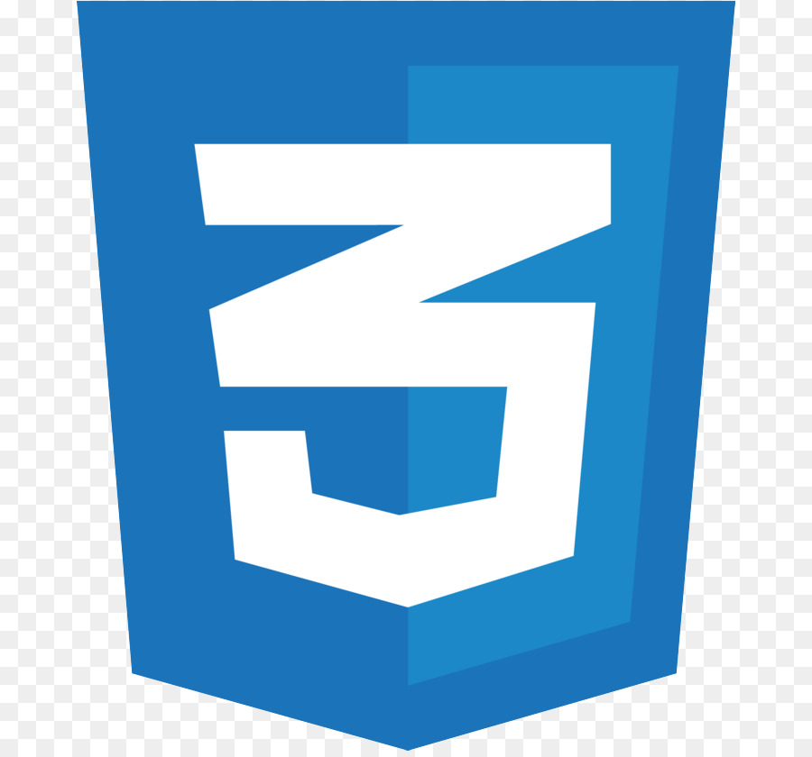

### Hi there, I'm Gautam👋

## I'm a Student at PES University and a Web Developer

 

### Tools I use:

 
 

[My Website](https://gautampb.vercel.app/)
 
[Instagram](https://www.instagram.com/_.gautampb._/)
 
[LinkedIn](https://www.linkedin.com/in/gautam-b-959394200/)
 

